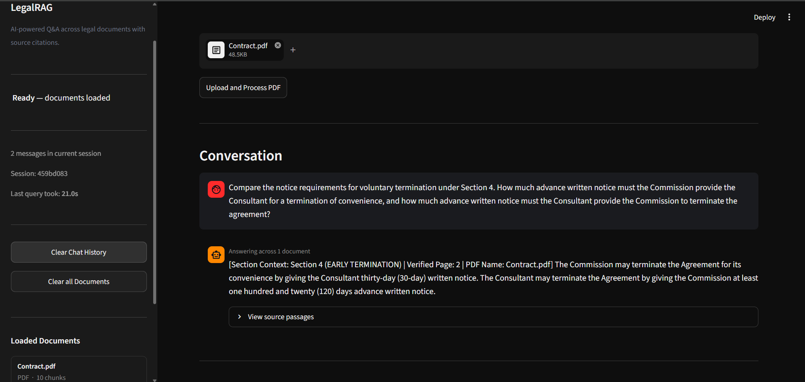

#  LegalRAG

### AI-powered Question Answering across Legal Documents with Source Citations



##  Overview

LegalRAG is a Retrieval-Augmented Generation (RAG) application that allows users to upload legal documents (PDFs) and ask questions in natural language.

The system retrieves relevant clauses from uploaded documents, reranks the results, and generates accurate answers with **document name, page number, and clause-level citations**.

No guessing. No unsupported answers. Every response is grounded in the uploaded legal documents.

---

#  Features

###  Multi-document Legal Q&A

* Upload multiple legal PDFs
* Ask questions across all documents simultaneously
* Retrieve information from contracts, agreements, and legal files

###  Source Citations

Every generated answer includes:

* Document name
* Page number
* Relevant clause/section
* Source passages used for generation

###  Advanced Retrieval Pipeline

Uses a hybrid retrieval approach:

* BM25 keyword search
* Vector similarity search
* MultiQuery retrieval
* Cross-encoder reranking

###  Conversation Memory

* Supports follow-up questions
* Maintains previous conversation context
* Provides context-aware answers

###  RAG Evaluation Logging

Every interaction is stored for evaluation:

Stored fields:

* Question
* Answer
* Retrieved contexts
* Source metadata

Compatible with RAGAS evaluation workflows.

###  Error Handling

Handles:

* Corrupted PDFs
* Network failures
* Rate limits
* Invalid documents

---
```
LegalRAG/

├── .streamlit/
│   └── config.toml
├── backend/
│   ├── __init__.py
│   ├── Document_Loader.py
│   ├── Text_Splitter.py
│   ├── Vector_Store.py
│   ├── multiquery.py
│   ├── rag_pipeline.py
│   └── logger.py
├── data/
│   ├── chroma_db/
│   └── Contract.pdf
│       # Sample legal document
├── docs/
│   └── sample_app.png
├── evaluation/
│   ├── logs/
│   │   ├── .gitkeep
│   │   └── 2026-06-22.json
│   │       # Daily interaction logs
│   └── testing_notes.md
├── frontend/
│   └── app.py
├── vragenv/
├── .env
│   # API keys and environment variables
├── .gitignore
│   # Ignored files configuration
├── README.md
│   # Project documentation
└── requirements.txt
    # Python dependencies
```
---

#  Installation

## 1. Clone Repository

```bash
git clone https://github.com/soumikchandra-ai/LegalRAG.git

cd LegalRAG
```

---

## 2. Create Virtual Environment

### Windows

```bash
python -m venv vragenv

vragenv\Scripts\activate
```

### Mac/Linux

```bash
python -m venv vragenv

source vragenv/bin/activate
```

---

## 3. Install Dependencies

```bash
pip install -r requirements.txt
```

---

## 4. Configure API Key

Create a `.env` file:

```env
GOOGLE_API_KEY=your_api_key_here
```

---

## 5. Run Application

```bash
streamlit run frontend/app.py
```

Application will open at:

```
http://localhost:8501
```

---

#  Usage

1. Open the Streamlit application
2. Upload one or more legal PDF files
3. Click **Process Documents**
4. Wait for the success message 
5. Enter your legal question
6. Click **Submit Query**
7. Expand **View Source Passages**
8. Review the cited document sections

---

#  Technology Stack

| Component             | Technology                   |
| --------------------- | ---------------------------- |
| Frontend              | Streamlit                    |
| PDF Processing        | PyMuPDF                      |
| Embeddings            | Google Gemini Embedding      |
| LLM                   | Google Gemini 2.5 Flash Lite |
| Vector Database       | ChromaDB                     |
| Retrieval             | BM25 + Vector Search         |
| Retrieval Enhancement | MultiQuery Retriever         |
| Reranking             | Cross Encoder (MiniLM)       |
| Evaluation            | RAGAS                        |

---

#  RAG Pipeline Flow

```
PDF Upload

      ↓

Document Extraction

      ↓

Text Chunking

      ↓

Embedding Generation

      ↓

ChromaDB Storage

      ↓

Hybrid Retrieval

(BM25 + Vector Search)

      ↓

Cross Encoder Reranking

      ↓

Gemini LLM Generation

      ↓

Answer + Citations
```

---

#  Performance

Tested on typical legal contract PDFs:

| Metric                | Value        |
| --------------------- | ------------ |
| Minimum Response Time | 11.32 seconds  |
| Maximum Response Time | 18.20 seconds  |
| Average Response Time | 15.20 seconds  |

---

#  Evaluation

Interaction logs are automatically stored:

```
evaluation/logs/YYYY-MM-DD.json
```

Each log contains:

```json
{
  "question": "",
  "answer": "",
  "contexts": [],
  "source_metadata": {}
}
```

These logs are structured for automated RAGAS evaluation.

---

#  Security Notes

* API keys are stored only in `.env`
* Sensitive documents remain local
* `.env` and database files should never be committed

Add to `.gitignore`:

```
.env
data/chroma_db/
evaluation/logs/
```


#  Author

Built as an AI-powered Legal Document Intelligence system using RAG architecture.
